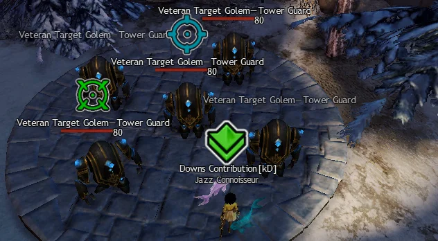
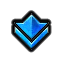
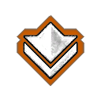
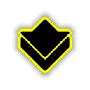
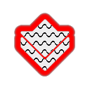
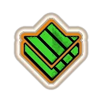
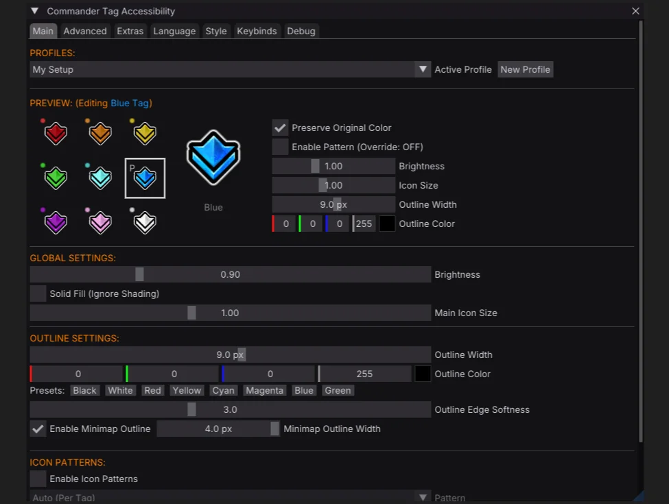
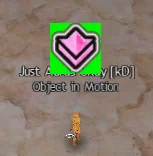
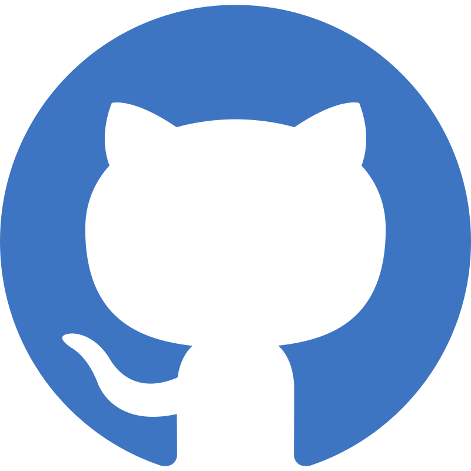
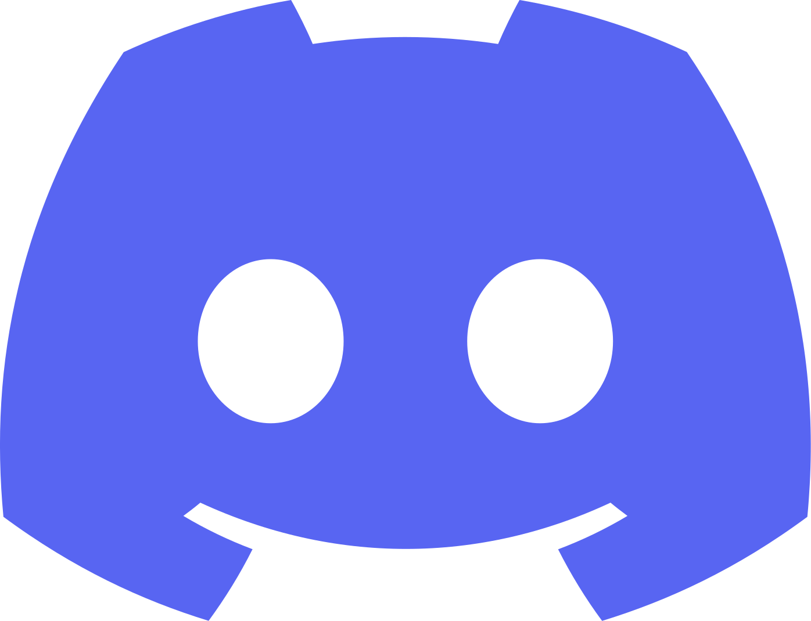

# Commander Tag Accessibility

A Guild Wars 2 accessibility addon for colorblind players.

---

This is for the squad member who always has to ask the commander to change their tag color when swapping from Desert to Alpine, as well as the ones too polite to ask.  
It's for the player who loses the tag in the visual clutter of a WvW zerg or an open world meta.  
We think making the tag stand out benefits everyone.

Customize commander tags with new colors, outlines, or patterns for better visibility and contrast.

---

## Features

### Outlines
Improve visibility against any background with a variety of high contrast outline styles.

| Soft Outline | Sharp Outline | Double Outline | Glow Outline |
| :---: | :---: | :---: | :---: |
|  |  |  |  |

### Custom Colors
Each tag can be individually recolored, pick a palette that benefits your needs or suits your taste.

| Cyan | Pink | Orange | Green |
| :---: | :---: | :---: | :---: |
|  |  |  |  |

### Patterns
Overlay distinct geometric patterns to quickly differentiate tags without relying on color alone.

* Horizontal Stripes
* Vertical Stripes
* Diagonal
* Grid
* Crosshatch
* Waves
* Zigzag
* Checker

| Waves Pattern | Diagonal Pattern | Crosshatch Pattern | Horizontal Pattern |
| :---: | :---: | :---: | :---: |
|  |  |  |  |

---

## Extras
In addition to commander tags, the addon also supports:
* Mentor Tag
* Party Target
* Squad Markers
* AOE Circle Outlines
* Chat Background
* Necromancer Shroud Screen Border
* WvW Map Objective Icons
* Plus more markers to come

| Target Marker | Personal Target | Combined Target |
| :---: | :---: | :---: |
|  |  |  |

---

## Installation

### Nexus
1. Download [CommanderTagAccessibility.dll](https://download.cta-addon.org/CommanderTagAccessibility.dll).
2. Place the dll in your Addons folder `\Guild Wars 2\Addons`.
3. Hotload in Nexus.

### Arcdps
1. Download [CommanderTagAccessibility.dll](https://download.cta-addon.org/CommanderTagAccessibility.dll).
2. Place the dll in your game folder `\Guild Wars 2`.
3. Will load on next game start.

### GW2Load
1. Download [CommanderTagAccessibility.dll](https://download.cta-addon.org/CommanderTagAccessibility.dll).
2. Place the dll in `\Guild Wars 2\addons\CommanderTagAccessibility`.
3. Will load on next game start.

### Standalone DLL Proxy
1. Download either [d3d9.dll](https://download.cta-addon.org/d3d9.dll) or [dxgi.dll](https://download.cta-addon.org/dxgi.dll).
2. Place the dll in your game folder `\Guild Wars 2`.
3. Will load on next game start.

Alternatively, the DLL can also be named `d3d11.dll` to support Nvidia Smooth Motion.

---

## FAQ

<strong>How does it work?</strong>

 

CTA is a texture mod, that hooks `PSSetShaderResource()` in order to modify specific game textures.
Because it doesn't otherwise hook the game's memory it won't break between patches.

<strong>I don't want to use Nexus, Arcdps or GW2Load, can I still use it?</strong>

 

Yes, follow the [Standalone DLL Proxy](#standalone-dll-proxy) installation instructions.

We aim to support all the popular addon loaders, CTA also works great standalone. You can switch loading method at any time without losing your settings.

<strong>Does the addon support Nvidia Smooth Motion?</strong>

 

[NVIDIA Smooth Motion](https://nvidia.custhelp.com/app/answers/detail/a_id/5621/~/enabling-smooth-motion-in-nvidia-app) works great with Guild Wars 2, however it isn't widely used because it is incompatible with both ArcDPS & Nexus.

By loading CTA as `d3d11.dll` or `d3d11_chainload.dll`, we can enable NVIDIA Smooth Motion for this addon while also chainloading ArcDPS & Nexus to make them compatible.

<strong>Can I make the commander tag bigger?</strong>

 

The addon allows for a 30% increase in size, it isn't possible to go any larger as the game doesn't allocate enough space for it.

The tag size is further determined by in-game UI size and DPI scaling.

<strong>Can I modify only the tag I'm following / Hide other tags?</strong>

 

No, all instances of each texture are replaced.

<strong>Is this addon allowed by Arenanet? Will I get banned?</strong>

 

Please carefully read ArenaNet's [Third-Party Programs Policy](https://help.guildwars2.com/hc/en-us/articles/360013625034-Policy-Third-Party-Programs), especially note the following statements:

> Note: ArenaNet does not review, approve, or endorse any third-party program. Each use of such a program is made at the account holder’s own risk.

> ...we are aware that some utilities help players without affecting others; that is, they do not give one player an advantage over another. While, in general, we will not take action on an account for the use of such a utility program or modification, action is subject to ArenaNet’s discretion. You use any third-party program at your own risk.

Use of any third-party software with Guild Wars 2 is at your own risk.

We have taken great care not to add anything that might be considered a competitive advantage (like highlighting specific buffs). We also decided not to allow users to set custom textures, seek to add art of our own, or allow swapping the regular tag for the cat tag, as we don't want to trivialise existing in-game achievements or disrupt potential for future unlocks or purchases.

---

## Changelog

### June 2026
* Added Necromancer screen border under Extras
* Added support for [GW2Load](https://github.com/gw2load/GW2Load) addon loader
* Added recoloring for WvW map objectives

### May 2026
* Added AOE circle outlines under Extras
* Added support for NVIDIA Smooth Motion
* Added Quick Access Icon

### April 2026
* Added chat background texture under Extras

---

## Contributing
Help us translate the addon into your language on [Crowdin](https://crowdin.com/project/commander-tag-accessibility). Any help is greatly appreciated!

## Issues / Feedback
Feel free to open an issue on [GitHub](https://github.com/jake-greygoose/Commander-Tag-Accessibility-releases/issues) or find us on Discord: [https://discord.gg/exfDSv3bux](https://discord.gg/exfDSv3bux).

---

  
  
  

